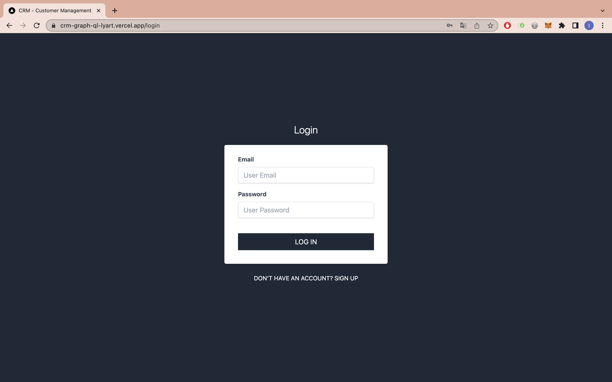

# CRMGraphQL

Fullstack application using the stack: NextJS - NodeJS - Apollo - GraphQL - MongoDB. This project belongs to the [React Avanzado: Fullstack Next.js, Apollo, MongoDB y GraphQL](https://www.udemy.com/course/fullstack-react-graphql-y-apollo-de-principiante-a-experto/) course.

## :pushpin: Table of contents

- [Introduction](#rocket-introduction)
- [Usage](#wrench-usage)
  - [Environment variables](#pagefacingup-environment-variables)
- [Built with](#hammer-built-with)
  - [Frontend](#computer-frontend)
  - [Backend](#gear-backend)
  - [Deploy](#package-deployment)
- [Links](#link-links)
- [Author](#woman-author)

## :rocket: Introduction

The application consists of two parts:

- _User authentication_. In this part you will find the login and sign up pages.



- _Main application_. The aim of this project is to **manage your customers and the orders they place**. You can also see who are the best customers and the best sellers in your company.


## :wrench: Usage

To deploy the project locally, follow these steps:

1. Clone my repository with the command `git clone https://github.com/Inmacc96/CRMGraphQL.git`.
2. Access the backend folder from a terminal and run the following commands:

- `npm install`
- `npm run dev`

3. Next, access the frontend folder from another terminal and run the following commands:

- `npm install`
- `npm run dev`

Finally, you will have the server at http://localhost:4000 and the client at http://locahost:3000.

### :page_facing_up: Environment variables

It is important to add the _.env_ file in the backend folder with the following content:

```
MONGO_URI = XXXX

JWT_SECRET = XXXX
```

where

- `MONGO_URI` is the URI of your MongoDB database,
- `JWT_SECRET` is the key to generate and decrypt your JWT.

In addition, you should add the _.env_ file in the frontend folder with the following:

```
NEXT_PUBLIC_BACKEND_URI=http://localhost:4000/
```

If in doubt, please consult the administrator.

## :hammer: Built with

### :computer: Frontend

- [Next JS](https://reactjs.org/): React library used.
- [Apollo Client](https://www.apollographql.com/docs/react/): Library that allows us, from a client, to read, modify and cache information from a GraphQL server.
- [tailwindcss](https://tailwindcss.com/): CSS framework used.
- [formik](https://formik.org/): Used for forms handling.
- [yup](https://www.npmjs.com/package/yup): Used for the validation of forms.
- [sweetalert2](https://sweetalert2.github.io/): Used as a confirmation modal after editing or deleting a customer, order or product.
- [recharts](https://recharts.org/en-US/): Used to add the best customers and best sellers graphs.
- [react-select](https://react-select.com/home): Used in the new order form.

### :gear: Backend

- [GraphQL](https://graphql.org/): Query language and data manipulation for APIs.
- [Apollo Server](https://www.apollographql.com/docs/apollo-server/): JS library to create the GraphQL API.
- [mongoose](https://mongoosejs.com/): Used to perform the queries to the MongoDB database.
- [dotenv](https://www.npmjs.com/package/dotenv): To access environment variables.
- [bcryptjs](https://www.npmjs.com/package/bcrypt): Used to encrypt the user's password and to check that the password entered matches the original one.
- [jsonwebtoken](https://www.npmjs.com/package/jsonwebtoken): Used for user authentication.


### :package: Deployment

- Frontend: [Vercel](https://vercel.com/)
- Backend: [Render](https://render.com/)

## :link: Links

- Solution URL: [https://github.com/Inmacc96/CRMGraphQL](https://github.com/Inmacc96/CRMGraphQL)
- Live Site URL: [https://crm-graph-ql-lyart.vercel.app](https://crm-graph-ql-lyart.vercel.app)

## :woman: Author

- GitHub - [inmacc96](https://github.com/Inmacc96)
- LinkedIn - [Inma Caballero Carrero](https://www.linkedin.com/in/inmacaballerocarrero/)
